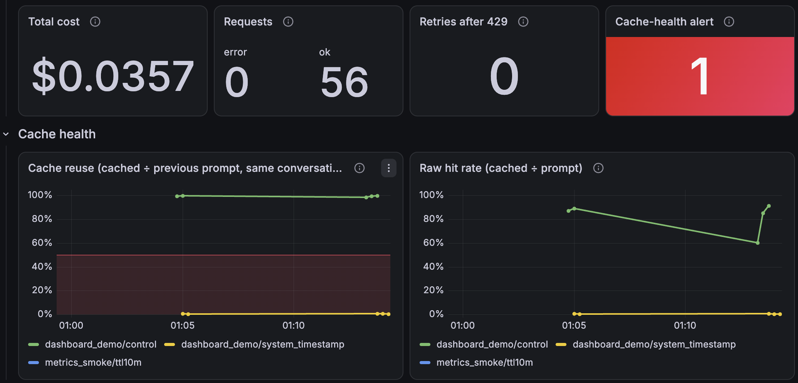
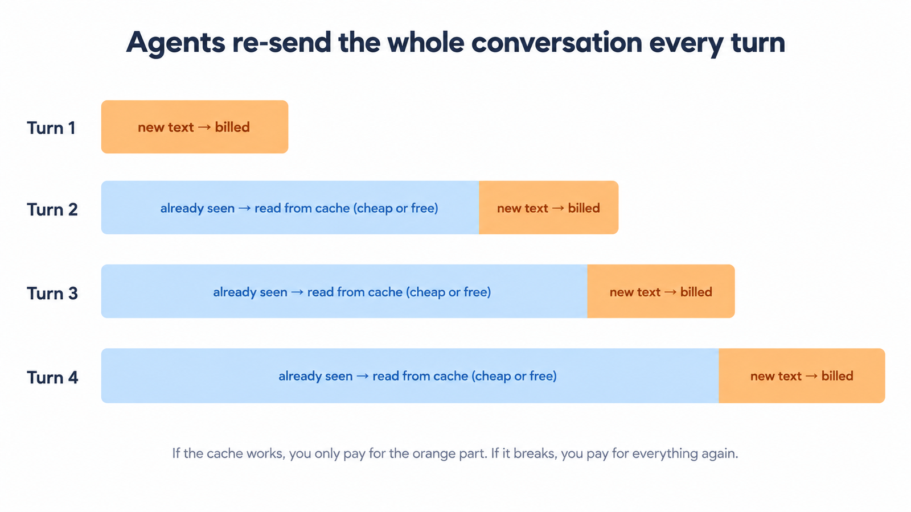
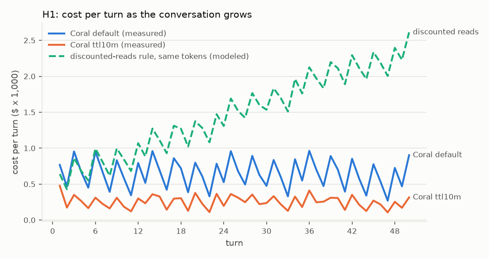
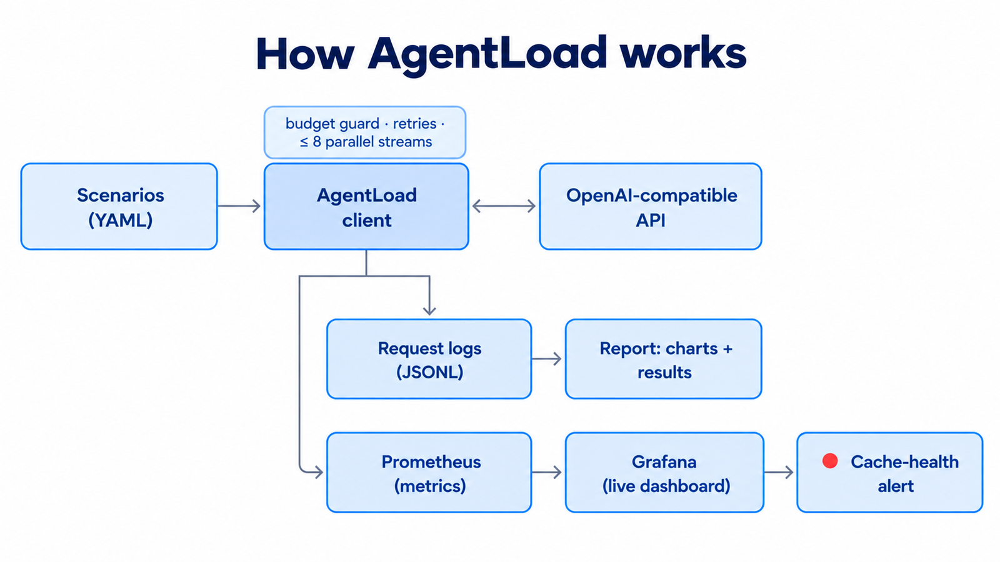
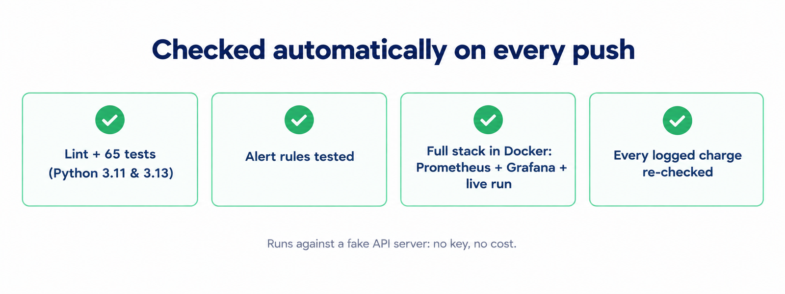
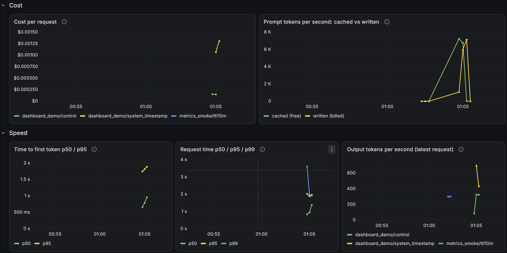

# AgentLoad

**Replay realistic AI-agent workloads against an OpenAI-compatible API, and measure what they really cost.**
Cost per turn, prompt-cache health, time to first token, tokens per second and tail latency, with a live dashboard and an alert for when caching breaks.

[](https://github.com/shachi2511/agentload/actions/workflows/ci.yml)

[](LICENSE)

**7 workload scenarios · 1,054 API requests priced · 2 models · contexts up to 500K tokens · 65 tests · 4 CI jobs · $1.08 total spend**


<sub>Live Grafana dashboard during two demo runs. The healthy loop (green) keeps ~100% cache reuse; the loop with a timestamp in its system prompt (yellow) drops to ~0%, and the cache-health alert fires for that loop only.</sub>

## Why it exists

AI agents re-send their whole, ever-growing conversation on every turn. What that costs depends almost entirely on prompt caching: text the provider has already seen can be re-read cheaply or for free, but nothing in a normal response tells you whether the cache is working. AgentLoad replays agent-shaped traffic, measures every request, and makes cache behavior, cost and latency visible.



## Key findings

**Case study:** the [Coral Bricks](https://www.coralbricks.ai/) inference API (GLM 5.3 Flash, DeepSeek V4.1 Flash), tested Oct 5–6, 2026. Each claim is labeled in the [full results](report/out/results.md) as measured, modeled, from the provider's docs, or inference.

- **Cost per turn stayed flat while the conversation grew 43×** (3K → 128K tokens), because cached reads were free. Billing cached reads at a discount instead of free would have made the same run about 2–6× more expensive (modeled).
- **A 10-minute cache setting cut a 50-turn loop's cost by 61–63%** in 3 of 3 runs, with the same cache reuse.
- **The cache setting changed the price, not how long the cache lived.** In 18 idle-gap checks from 2 to 35 minutes, a block billed for 10 minutes was still cached after 30; the first misses came at 35.
- **A warm cache cut time to first token 3.3× / 5.7× / 7.7×** at 100K / 250K / 500K tokens. A cold 500K prompt waited ~16 s.
- **Two common agent bugs:** a timestamp in the system prompt broke caching on every turn and cost 7.8× more; one early edit cost a single ~8× turn, then recovered.
- **Chat vs Responses API:** Responses sent 15× less data per request but cost 2.4–2.6× more in 4 of 4 runs (cache writes billed at the full rate).
- **Under concurrency** (1 → 8 streams), each stream slowed (DeepSeek 408 → 258, GLM 284 → 188 tokens/s) while total throughput kept rising. 0 rate limits in 270 requests.



→ [Full results, all charts and sources](report/out/results.md) · [Raw logs](results/)

## How it works



- **Scenarios** are small YAML files describing agent behavior: long loops, huge contexts, parallel sub-agents, idle pauses, edits and bugs, concurrency, Chat vs Responses.
- The **async client** streams every request, records timing and the provider's usage and cost fields, and runs every request through a **budget guard** that reserves the worst-case cost first and refuses to overspend.
- Every request becomes one line of **JSONL**. The **report** turns the logs into charts and a results page; no number is typed by hand.
- With `--metrics-port`, live metrics go to **Prometheus**, a **Grafana** dashboard (defined as code) and a **cache-health alert** with a [runbook](docs/runbooks/cache_health.md).

| Part | Where |
|---|---|
| Workload scenarios (7 types) | [`scenarios/`](scenarios/), [`agentload/runner.py`](agentload/runner.py) |
| Async streaming client, retries, budget guard | [`agentload/client.py`](agentload/client.py), [`agentload/budget.py`](agentload/budget.py) |
| Billing model, checked against every logged charge | [`agentload/pricing.py`](agentload/pricing.py), [`agentload/pricing_report.py`](agentload/pricing_report.py) |
| Report: 8 charts + results page | [`report/`](report/) |
| Live metrics, dashboard, alert, runbook | [`agentload/exporter.py`](agentload/exporter.py), [`dashboards/`](dashboards/), [`alerts/`](alerts/), [`docs/runbooks/`](docs/runbooks/) |
| Fake API server + end-to-end test | [`tests/mock_server.py`](tests/mock_server.py), [`tests/`](tests/) |
| API probes used to confirm behavior | [`scripts/`](scripts/) |

## Quick start

```bash
git clone https://github.com/shachi2511/agentload && cd agentload
python -m venv .venv && source .venv/bin/activate
pip install -e ".[dev]"
python -m pytest -q          # 65 tests, including a full run against a fake API
```

**Try it free, no API key** (a local fake server that imitates prefix caching and block billing):

```bash
PYTHONPATH=. python tests/mock_server.py --port 8099 &
AGENTLOAD_BASE_URL=http://127.0.0.1:8099/v1 CORAL_API_KEY=not-needed \
  PYTHONPATH=. python -m agentload.runner scenarios/ci_smoke.yaml
PYTHONPATH=. python report/report.py        # writes report/out/results.md + charts
```

**Real run and live dashboard** (the key is read from the environment and never printed):

```bash
export CORAL_API_KEY=...                   # your key
./scripts/obs_up.sh                        # Prometheus + Grafana via Homebrew, or: docker compose up -d
PYTHONPATH=. python -m agentload.runner scenarios/dashboard_demo.yaml --metrics-port 9108
# open http://localhost:3000/d/agentload
```

Each scenario sets its own spending cap (at most $1.50 per run), on top of a lifetime cap of $5 in [`agentload/budget.py`](agentload/budget.py).

## Built to be trusted



- **The billing model reproduces all 1,054 logged charges** to within $0.00000001, re-checked in CI on every push.
- **65 tests**, plus an end-to-end run of the whole tool against a fake API server, so CI needs no key and costs nothing.
- **Safe by default:** worst-case cost reserved before every request, at most 8 parallel streams, rate-limit retries counted rather than hidden, the API key never printed or logged.
- **Raw logs are published** in [`results/`](results/), so anyone can rebuild the report and check every number.



<details>
<summary><b>Hard problems I solved</b></summary>

- **Working out the billing rules from the outside.** The API returns only a cost per request. By varying cache settings and prompt sizes I found the rules: cached reads are free, cache writes are billed per 10-minute block at a third of the listed write price (default: 3 blocks), opting out bills new text as plain input, the Responses API bills 3 blocks, and charges round to 8 decimals. The resulting model matches every one of 1,054 charges.
- **Hit rate was misleading.** "Cached ÷ prompt" fell to 55% in a perfectly healthy loop, simply because each turn adds new text. I replaced it with *cache reuse* (cached ÷ previous prompt in the same conversation), which stays near 100% when the cache works and drops to ~0% when it breaks. The dashboard and alert use it.
- **The dashboard undercounted requests.** Prometheus's `increase()` misses the first increment of a brand-new counter. Fix: create every series at zero before the run, plus a short warm-up.
- **CI checks that passed by luck.** Alert rules report `unknown` health until their first evaluation, and a finished run's metrics go stale on the next scrape. Both checks only passed when the timing happened to line up; they now retry and query over a 5-minute window.
- **Never overspending under concurrency.** The budget guard reserves a worst-case estimate before each request (under a lock, across up to 8 parallel streams), settles to the real cost afterwards, and writes its ledger atomically.

</details>

<details>
<summary><b>Open questions I couldn't answer from outside</b></summary>

1. Is billing cache writes per 10-minute block the intended design?
2. Why does the default retention bill 3 blocks?
3. Is the TTL meant as a billing unit or an expiry? A 10-minute block was still cached at 30 minutes.
4. Why did sub-agents launched at the same moment share only part of the cache (60% vs 91% when warmed first)?
5. Why does the Responses API bill 3 blocks when a 10-minute TTL is requested?
6. Why did sending instructions only on the first Responses turn break the cache in 2 of 4 runs but not the others?

</details>

## Limits

- **Outside-in testing.** I can't see the provider's infrastructure; results reflect its public service on Oct 5–6, 2026 and may change.
- **Small scale on purpose.** At most 8 parallel streams, no stress testing. Repeated runs for the main findings; some idle-gap and fan-out results are single observations. Answer quality (e.g. 4-bit models vs full precision) is out of scope.
- **One-person project on a self-imposed $5 budget** (as a student). Total spent: $1.08.

## License

[MIT](LICENSE) © 2026 Shachi Shriwastava
