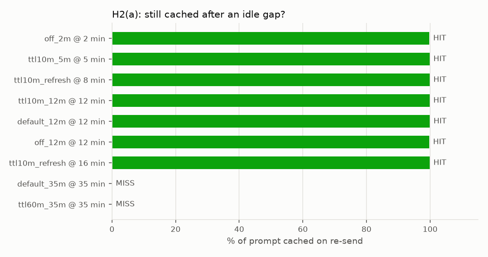
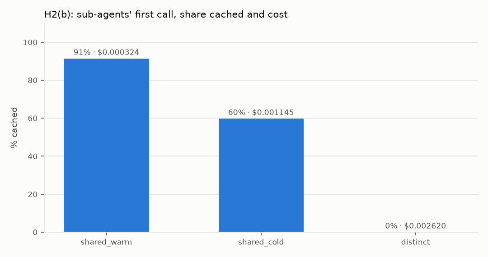
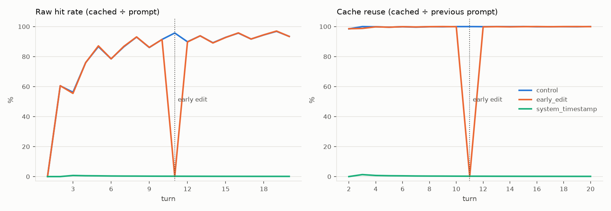
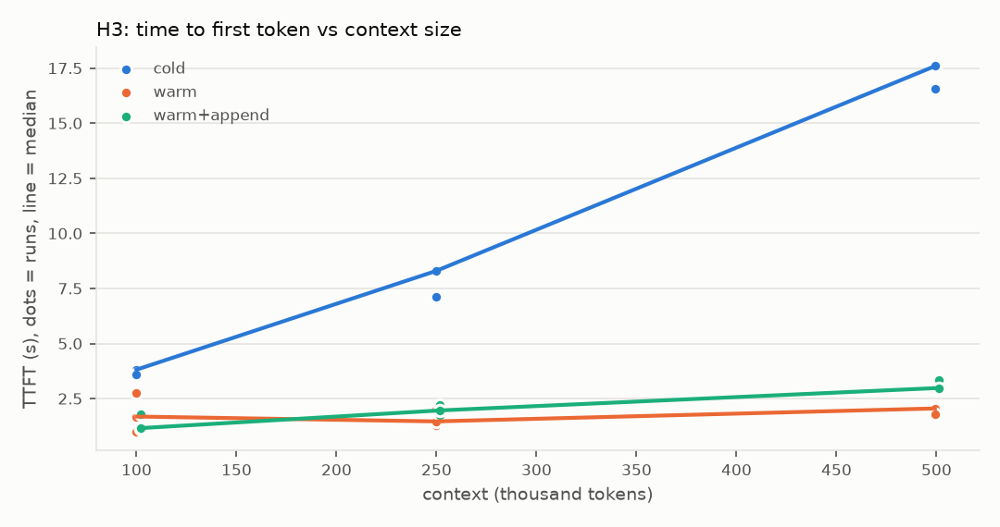
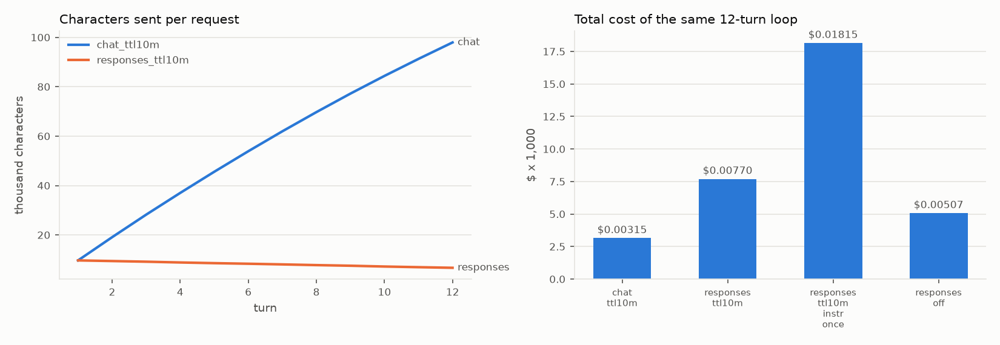
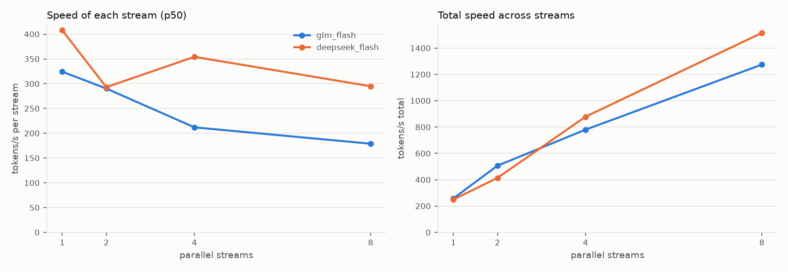
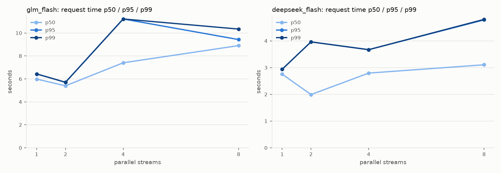

# AgentLoad results

Generated 2026-10-06 00:25 from the JSONL logs. Test dates: 2026-10-05 to 2026-10-06. Every number below is computed from the logs.

Labels: **[measured]** our own runs · **[modeled]** real token counts re-priced under a hypothetical rule · **[docs]** Coral's documentation · **[inference]** our reading of the data.

## Billing model check

Our model of Coral's billing reproduced **419 of 419** logged charges (worst difference $0.0000000033) across 10 log files **[measured]**: cached reads free; writes billed per 10-minute block (listed write price ÷ 3 per block, max 3); retention "off" billed as plain input; Responses billed as 3 blocks.

## Scoreboard

| hypothesis | verdict | key number |
|---|---|---|
| H1 flat cost per turn | **HELD** | Coral ~$0 vs discounted +$0.0015 per turn per +100K context |
| H2 plain loop keeps the cache | **HELD** | reuse 99.9% mean (raw hit rate as low as 56%) |
| H2(a) idle gap longer than TTL | **NOT HELD at 12 min / HELD at 35 min** | 10m block still cached at 12 min; default and '60m' gone by 35 min |
| H2(b) fan-out with shared vs different prefixes | **HELD** | warm shared prefix 91% cached vs distinct 0% |
| H2(c) early edit breaks the prefix | **HELD** | one edit = one full re-write, then recovery |
| H3 warm cache cuts TTFT at long context | **HELD** | 2.3x / 5.7x / 8.6x faster warm vs cold |
| H4 Responses vs Chat | **MIXED** | 15x smaller requests, but 2.4x the cost (TTL ignored) |
| H5 per-stream speed drops under concurrency | **HELD** | glm_flash 324→179 tok/s; deepseek_flash 408→295 tok/s |

## H1: flat cost per turn

- `default`: context 2,993 → 128,798 tokens. Coral cost per turn, first 10 → last 10: $0.000632 → $0.000584 **[measured]**. Discounted-reads rule on the same tokens: $0.000747 → $0.002202 **[modeled]**. Cost added per +100K tokens of context: Coral -$0.000028, discounted +$0.001468. Whole run: $0.03233 vs $0.07405 (2.3x).
- `ttl10m`: context 2,991 → 128,625 tokens. Coral cost per turn, first 10 → last 10: $0.000227 → $0.000216 **[measured]**. Discounted-reads rule on the same tokens: $0.000714 → $0.002209 **[modeled]**. Cost added per +100K tokens of context: Coral -$0.000006, discounted +$0.001503. Whole run: $0.01273 vs $0.07426 (5.8x).
- Same loop with `ttl: "10m"` instead of the default: 61% cheaper overall **[measured]**.

_Source: `20261005-225939-sequential-4382da.jsonl`_

## H2: cache reuse in a plain loop

- Plain 50-turn loop: cache reuse mean 99.9%, min 98.4% **[measured]**. Raw hit rate (cached ÷ prompt) dipped to 55.6% even though the cache was working: it mostly reflects how long the conversation is **[inference]**.

_Source: `20261005-225939-sequential-4382da.jsonl`_

## H2(a): idle gaps

| probe | after | cached | verdict | re-send cost |
|---|---|---|---|---|
| off_2m | 2 min | 99.8% | HIT | $0.000023 |
| ttl10m_5m | 5 min | 99.9% | HIT | $0.000027 |
| ttl10m_refresh | 8 min | 99.9% | HIT | $0.000039 |
| ttl10m_12m | 12 min | 99.8% | HIT | $0.000030 |
| default_12m | 12 min | 99.9% | HIT | $0.000030 |
| off_12m | 12 min | 99.8% | HIT | $0.000032 |
| ttl10m_refresh | 16 min | 99.9% | HIT | $0.000059 |
| default_35m | 35 min | 0.0% | MISS | $0.002412 |
| ttl60m_35m | 35 min | 0.0% | MISS | $0.002339 |

- One check per probe: first observations, not proof **[measured]**. A miss could also be early eviction, which we can't see from outside.

_Source: `20261005-231533-idle_gaps-8d4480.jsonl`_

## H2(b): fan-out

- `shared_warm`: sub-agent first call 91.4% cached, $0.000324 each, TTFT p50 1.07s; later turns 93.7% cached **[measured]**.
- `shared_cold`: sub-agent first call 59.8% cached, $0.001145 each, TTFT p50 2.05s; later turns 91.2% cached **[measured]**.
- `distinct`: sub-agent first call 0.0% cached, $0.002620 each, TTFT p50 2.11s; later turns 94.1% cached **[measured]**.

_Source: `20261005-231221-fanout-642d3c.jsonl`_

## H2(c): early edit and the timestamp bug

- Early edit at turn 11: reuse 0.0%, cost $0.002111 (~8x a normal turn); next turn reuse 99.8% **[measured]**.
- Timestamp in the system prompt (a common agent bug): reuse mean 0.3%; cost per turn 0.001321 → 0.003025 (growing); whole run 7.8x the control **[measured]**.

_Source: `20261005-235235-early_edit-195b1b.jsonl`_

## H3: warm vs cold at long context

| size | cold TTFT p50 | warm TTFT p50 | speed-up | warm + 2K new | n |
|---|---|---|---|---|---|
| 100K | 3.81s | 1.68s | 2.3x | 1.16s | 3 |
| 250K | 8.29s | 1.46s | 5.7x | 1.96s | 3 |
| 500K | 17.59s | 2.05s | 8.6x | 2.98s | 3 |

- Measured with n=3 per size: enough for the 2-9x effect, not for p95/p99 **[measured]**.

_Source: `20261005-230550-long_context-cbfeee.jsonl`_

## H4: Responses vs Chat Completions

| variant | total $ | write $/M | sent chars (last turn) | reuse mean/min | first answer p50 | total p50 |
|---|---|---|---|---|---|---|
| chat_ttl10m | 0.00315 | 0.0767 | 97,944 | 99.6% / 98.4% | 1.03s | 1.21s |
| responses_ttl10m | 0.00770 | 0.2300 | 6,685 | 99.7% / 98.6% | 0.60s | 0.67s |
| responses_ttl10m_instr_once | 0.01815 | 0.2300 | 6,514 | 73.2% / 0.0% | 2.05s | 4.09s |
| responses_off | 0.00507 | - | 6,685 | 99.7% / 98.5% | 0.65s | 0.74s |

- Responses sent 15x less data on the last turn and was faster (total p50 0.67s vs 1.21s, n=12 per variant: suggestive only) **[measured]**.
- But it cost 2.4x more: Responses billed writes at $0.2300/M despite `ttl: "10m"` (Chat: $0.0767/M) **[measured]**. Coral's docs say cache options apply to both APIs **[docs]**.

_Source: `20261006-000442-api_compare-509331.jsonl`_

## H5: speed under concurrency

| model | streams | n | per-stream tok/s p50 (min) | total tok/s | total time p50/p95/p99 | 429s |
|---|---|---|---|---|---|---|
| glm_flash | 1 | 3 | 324 (301) | 257 | 6.0/6.4/6.4s | 0 |
| glm_flash | 2 | 6 | 290 (283) | 506 | 5.4/5.7/5.7s | 0 |
| glm_flash | 4 | 12 | 212 (139) | 780 | 7.4/11.2/11.2s | 0 |
| glm_flash | 8 | 24 | 179 (153) | 1274 | 8.9/9.4/10.3s | 0 |
| deepseek_flash | 1 | 3 | 408 (291) | 249 | 2.8/2.9/2.9s | 0 |
| deepseek_flash | 2 | 6 | 293 (200) | 413 | 2.0/4.0/4.0s | 0 |
| deepseek_flash | 4 | 12 | 354 (301) | 879 | 2.8/3.7/3.7s | 0 |
| deepseek_flash | 8 | 24 | 295 (167) | 1515 | 3.1/4.8/4.8s | 0 |

- With few samples, p99 is effectively the slowest request.
- DeepSeek single-stream samples: [291, 408, 608] tok/s vs the advertised 'up to 469' **[measured] / [docs]**.

_Source: `20261005-235603-concurrency-959236.jsonl`_

## Notes and limitations

- Outside-in testing: we can't see Coral's infrastructure. Results reflect their production service on the test dates above and may change.
- One student, a self-imposed $5 total budget, at most 8 parallel streams, no stress testing. Many results rest on 1-3 samples per setting.
- The discounted-reads comparison is modeled on Coral's own base prices; it does not name or quote any other provider.
- Out of scope: answer quality of 4-bit models vs full precision (open question).

## Runs used

- `20261005-225939-sequential-4382da.jsonl`
- `20261005-230550-long_context-cbfeee.jsonl`
- `20261005-231221-fanout-642d3c.jsonl`
- `20261005-231533-idle_gaps-8d4480.jsonl`
- `20261005-235235-early_edit-195b1b.jsonl`
- `20261005-235603-concurrency-959236.jsonl`
- `20261006-000442-api_compare-509331.jsonl`
